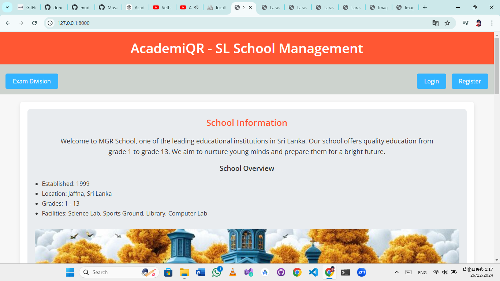
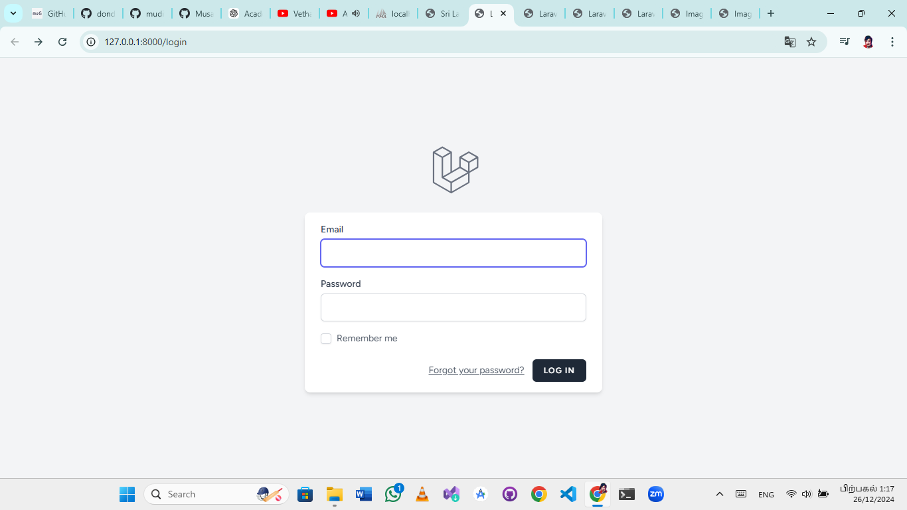
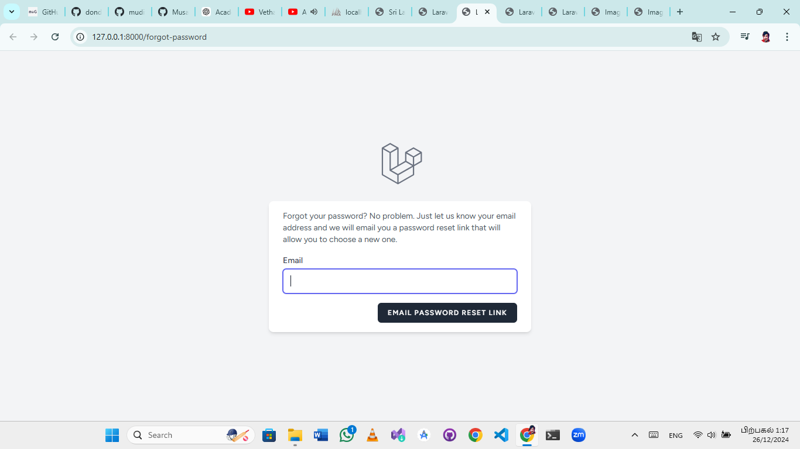
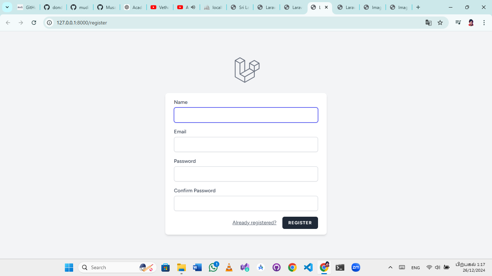
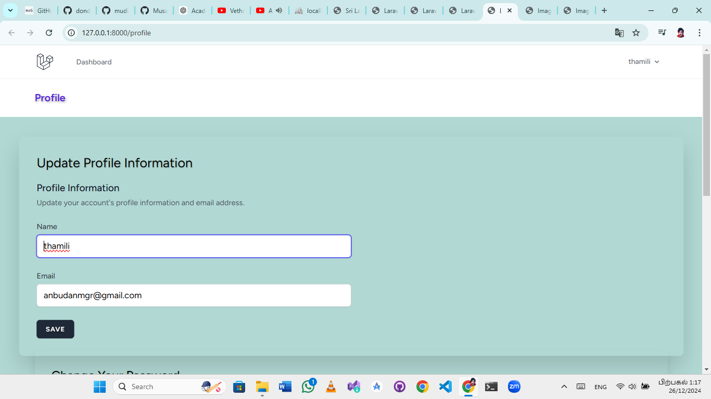
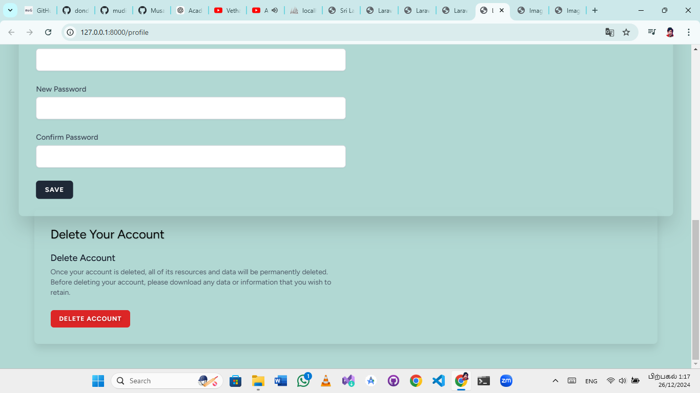
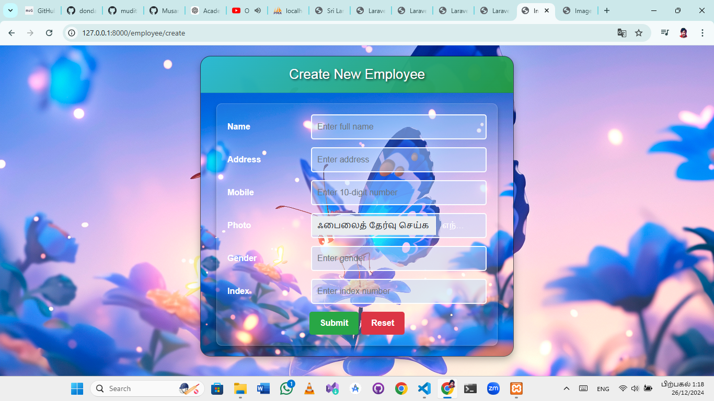
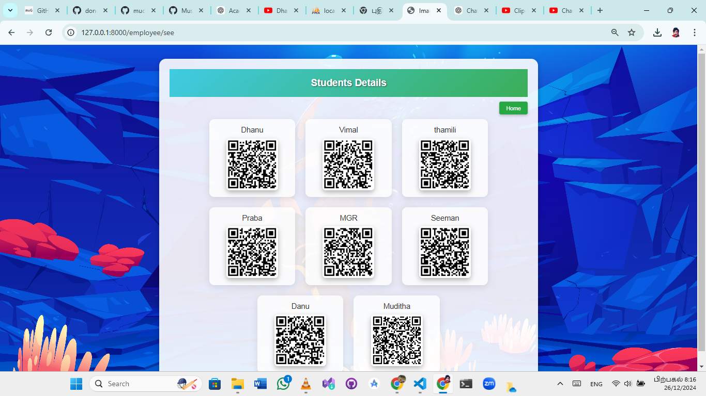
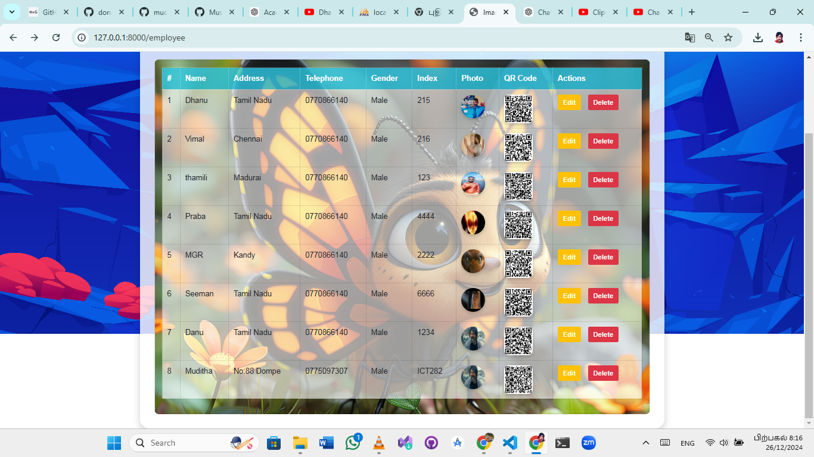

# AcademiQR

**AcademiQR** is a student management system built using Laravel. This project allows you to manage student information with ease, providing features such as CRUD operations, user authentication, PDF generation, and QR code creation.

## Features

- **CRUD Operations**: Add, view, edit, and delete student records.
- **Authentication**: User login, registration, and password reset functionality.
- **PDF Export**: Download student details in a PDF format.
- **QR Code Generation**: Generate QR codes for students with their unique details.

## Screenshots

Here are some screenshots of the **AcademiQR** application:


<p><em>Example of the dashboard view.</em></p>


<p><em>View of the student list.</em></p>


<p><em>Detailed student profile view.</em></p>


<p><em>Download student details in PDF format.</em></p>


<p><em>Generated QR code for student details.</em></p>


<p><em>Generated QR code for student details.</em></p>


<p><em>Generated QR code for student details.</em></p>


<p><em>Generated QR code for student details.</em></p>


<p><em>Generated QR code for student details.</em></p>

## Installation

### Prerequisites

- PHP 8.0 or higher
- Composer (for managing dependencies)
- XAMPP (or any local server)
- MySQL database

### Setup Instructions

1. **Clone the repository:**

   ```bash
   git clone https://github.com/your-username/AcademiQR.git

2. Navigate to the project directory:
    cd AcademiQR

3. Install dependencies using Composer:
    composer install

4. Set up your .env file:
    Copy .env.example to .env:
    cp .env.example .env

5. Update the .env file with your database credentials.
    Generate the application key:
    php artisan key:generate

6. Run database migrations:
    php artisan migrate

7. Serve the application:
    php artisan serve
   
Your application should now be accessible at http://localhost:8000.


